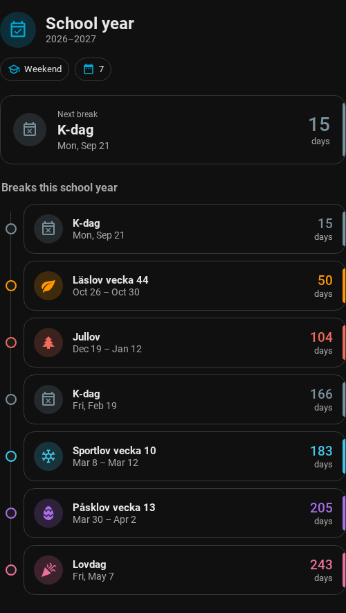

# School Year Card

A Home Assistant Lovelace card that presents closures from the
[School Year integration](https://github.com/Caine72/ha-school-year) as a chronological,
mobile-friendly timeline. It uses the integration's normalized data and does not scrape or
interpret source pages in the browser.



## Features

- Highlights the active or next school break with an inclusive countdown.
- Shows the school year's closures as a chronological timeline.
- Uses Material Design Icons and Home Assistant theme variables.
- Includes a visual editor built with Home Assistant's standard form and selectors.
- Works alongside Bubble Card and Mushroom cards without requiring either one.
- Supports English and Swedish labels.

## Installation

Install the repository as a HACS dashboard plugin, or copy `dist/ha-school-year-card.js` to
Home Assistant's `www` directory and register it as a JavaScript module resource.

## Configuration

Add **School Year Card** from the dashboard card picker and select the integration's
**School year status** sensor. All options are available in the visual editor.

```yaml
type: custom:school-year-card
entity: sensor.school_year_status
title: School year
past_breaks: dim
show_header: true
show_status: true
show_next_break: true
show_countdown: true
show_weekday_for_single_day: true
compact: false
```

The status sensor must expose the School Year integration's `events` attribute. The card only
renders entries marked `school_closed: true`; malformed entries are ignored safely.

## Development

```console
corepack enable
yarn install --immutable
yarn validate
```

The unit suite covers the data contract, date boundaries, registration, editor, and failure
states. The Playwright smoke test loads the production bundle in a real Home Assistant frontend;
it is intentionally kept separate because it requires a running Home Assistant instance.

## Support scope

The card follows the data contract of the School Year integration. That integration currently
supports Skellefteå kommun Grundskola only.
